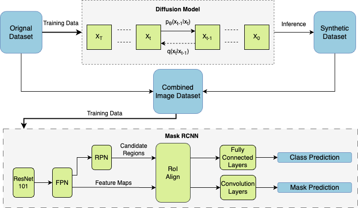
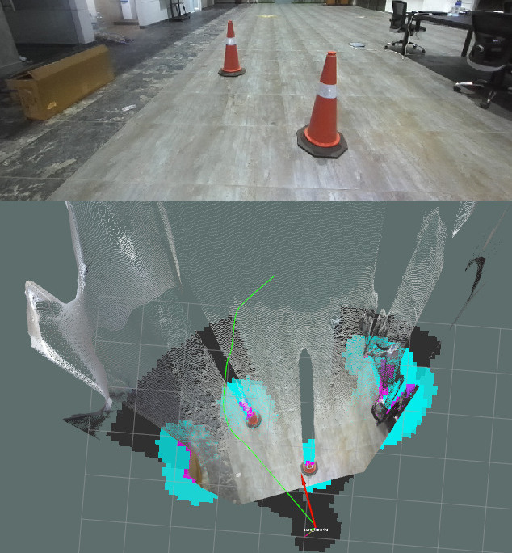

<!-- # Research Publications and Contributions -->

## 1. Syn2Real Domain Generalization for Underwater Mine-like Object Detection Using Side-Scan Sonar

**Authors:** Aayush Agrawal, et al.  
**Summary:** This work introduces a domain generalization approach for detecting underwater mine-like objects using side-scan sonar imagery. By bridging the gap between synthetic and real-world datasets, the method enhances detection accuracy for critical underwater applications.  
**Status:** Under Review - _Journal of Geoscience and Remote Sensing Letters_.

---

## 2. Preliminary Evaluation of an Ultrasound-Guided Robotic System for Autonomous Percutaneous Intervention

**Authors:** Mohan Pratima, Aayush Agrawal, and Niravkumar A. Patel  
**Summary:** This study evaluates a robotic system for autonomous medical interventions, integrating ultrasound guidance and advanced 3D reconstruction algorithms for accurate targeting. The research addresses alignment challenges to improve system precision.  
**Status:** Under Review - _International Conference on Robotics and Automation (ICRA 2025)_.

---

## 3. LOID: Lane Occlusion Inpainting and Detection for Enhanced Autonomous Driving Systems

**Authors:** Aayush Agrawal, et al.  
**Summary:** LOID proposes a novel algorithm for detecting and inpainting occluded lanes, ensuring robust lane detection in challenging environments for autonomous driving systems.  
**Status:** Under Review - _Journal of Machine Vision and Applications_.

---

## 4. HyperVL-Sim: Accelerating Autonomy with Hyper-Realistic Vehicle-in-Loop Simulation for Sim2Real Transfer Learning

**Authors:** Aayush Agrawal, Qiranul Saadiyean, and Suresh Sundaram  
**Summary:** This research introduces HyperVL-Sim, a hyper-realistic vehicle-in-loop simulation framework leveraging NeRF models for sim-to-real transfer learning, enhancing autonomous vehicle development.  
**Status:** To be Submitted - _International Conference on Intelligent Robots and Systems 2025_.

---

## 5. Design and Cyber Security Reports: Vikram Autonomous Ground Vehicle for the Intelligent Ground Vehicle Competition 2023

**Authors:** Aayush Agrawal and Team Abhiyaan, IIT Madras

**Summary:**  
This document combines the design and cybersecurity reports detailing the development and implementation of Vikram, an autonomous ground vehicle. Vikram secured top positions in both the design and cyber challenges at IGVC 2023. The design section highlights the innovative engineering approaches used to create Vikram, while the cybersecurity section covers measures ensuring secure and reliable operations during the competition.

- **Design Report:**  
  [Vikram Autonomous Ground Vehicle - Design Report](https://igvc.secs.oakland.edu/design/2023/15.pdf)

- **Cyber Security Report:**  
  [Vikram Autonomous Ground Vehicle - Cyber Security Report](https://igvc.secs.oakland.edu/design/2023/16.pdf)

---

## 6. Design Report: Vidyut Autonomous Ground Vehicle for the Intelligent Ground Vehicle Competition 2024

**Authors:** Aayush Agrawal and Team Abhiyaan, IIT Madras  
**Summary:** This document describes the design innovations in Vidyut, the autonomous vehicle developed for IGVC 2024, focusing on advancements in perception and path-planning algorithms.  
**Link:** [Design Report](https://igvc.secs.oakland.edu/design/2024/3.pdf)

---

## 7. Bolt: The Autonomous Institute Shuttle

**Authors:** Aayush Agrawal and Team Abhiyaan, IIT Madras  
**Summary:** Bolt is an autonomous shuttle achieving Level 5 autonomy, designed to navigate the IIT Madras campus. It incorporates advanced perception, planning, and control algorithms to ensure safe and efficient operation.

