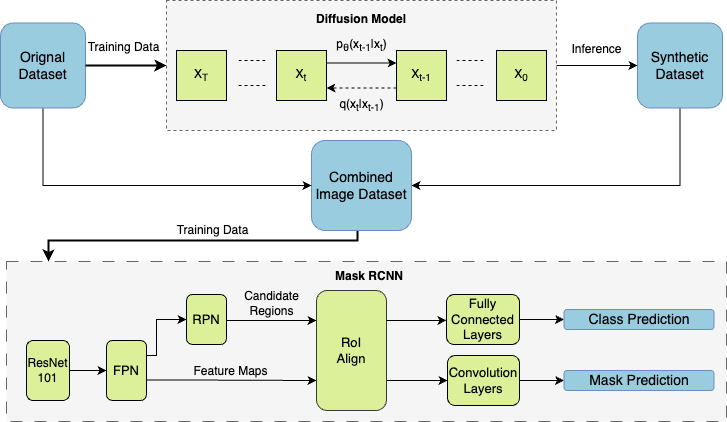
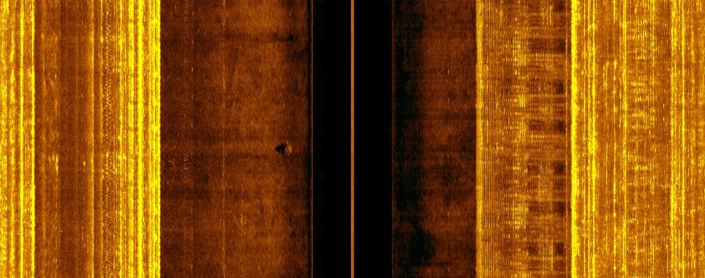

---
title: "Syn2Real Domain Generalization for Underwater Mine-like Object Detection Using Side-Scan Sonar"
excerpt: "This work introduces a domain generalization approach for detecting underwater mine-like objects using side-scan sonar imagery. By bridging the gap between synthetic and real-world datasets, the method enhances detection accuracy for critical underwater applications. "
collection: portfolio
---